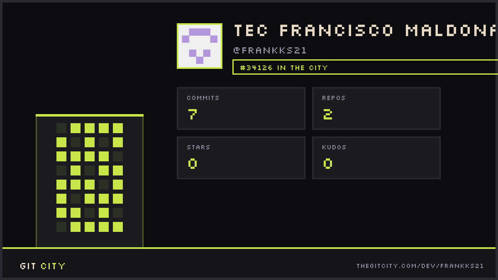

<!-- Banner animado -->


<!-- GitCity -->
<div align="center">
  
</div>

<!-- Typing SVG -->
[](https://git.io/typing-svg)

<br/>

<!-- Badges de contacto / redes -->
[](https://linkedin.com/in/frankks21)
[](mailto:tu@email.com)
[](https://tu-portfolio.com)
[](https://github.com/frankks21)

<br/>


</div>

---

## 🧠 Sobre mí

```python
class DataScientist:
    def __init__(self):
        self.nombre      = "Francisco Eliud Maldonado Morales"
        self.rol         = "Data Scientist & ML Engineer"
        self.ubicacion   = "México 🇲🇽"
        self.lenguajes   = ["Python", "JavaScript", "TypeScript", "SQL"]
        self.frameworks  = ["React", "Next.js", "Vue.js", "Scikit-learn", "TensorFlow"]
        self.bases_datos = ["PostgreSQL", "MySQL", "MongoDB", "Redis"]
        self.intereses   = ["Machine Learning", "Data Visualization",
                            "NLP", "Análisis Predictivo", "Full Stack Dev"]

    def filosofia(self):
        return "Los datos no mienten — pero sí necesitan quien los interprete correctamente."

    def objetivo_2025(self):
        return "Desarrollar soluciones de IA que generen impacto real en la industria."

me = DataScientist()
print(me.filosofia())
```

> 🎯 Apasionado por convertir datos complejos en soluciones claras y accionables. Combino habilidades en **Machine Learning**, **análisis estadístico** y **desarrollo web** para construir productos data-driven de extremo a extremo.

---

## 🚀 Proyectos Destacados

<div align="center">

| 🗂️ Proyecto | 📋 Descripción | 🛠️ Stack | ⭐ |
|------------|---------------|---------|-----|
| [**🔮 Predictor de Churn**](https://github.com/frankks21/churn-predictor) | Modelo de ML para predecir abandono de clientes con 94% de accuracy | `Python` `XGBoost` `Streamlit` | ⭐ Featured |
| [**📊 Dashboard Analytics**](https://github.com/frankks21/analytics-dashboard) | Plataforma interactiva de visualización de KPIs empresariales en tiempo real | `React` `Next.js` `PostgreSQL` | ⭐ Featured |
| [**🤖 NLP Sentiment API**](https://github.com/frankks21/nlp-sentiment) | API REST para análisis de sentimientos en reseñas con modelos Transformer | `Python` `FastAPI` `HuggingFace` | ⭐ Featured |
| [**🗃️ ETL Pipeline**](https://github.com/frankks21/etl-pipeline) | Pipeline automatizado de extracción, transformación y carga de datos masivos | `Python` `SQL` `Airflow` | — |

</div>

---

## 🛠️ Stack Tecnológico

<div align="center">

### 🐍 Data Science & Machine Learning


### 🌐 Desarrollo Web & Frontend


### 🗄️ Bases de Datos


### ⚙️ Herramientas & DevOps


</div>

---

## 📊 Estadísticas de GitHub

<div align="center">


<br/>


<br/>

<!-- Gráfica de actividad -->


</div>

---

## 📈 Perfil de Habilidades

<div align="center">

| Área | Habilidad | Nivel |
|------|-----------|-------|
| 🐍 Python para Data Science | `Pandas` `NumPy` `Scikit-learn` | ████████████ 95% |
| 🤖 Machine Learning | `Supervisado` `No supervisado` `NLP` | ███████████░ 90% |
| 🌐 Frontend Development | `React` `Next.js` `Vue` `TypeScript` | █████████░░░ 80% |
| 🗄️ Bases de Datos | `SQL` `PostgreSQL` `MongoDB` | ████████████ 85% |
| 📊 Visualización de Datos | `Matplotlib` `Plotly` `D3.js` | ██████████░░ 82% |
| ⚙️ MLOps & Deploy | `Docker` `FastAPI` `Streamlit` | ████████░░░░ 75% |

</div>

---

## 🏆 Trofeos de GitHub

<div align="center">

[](https://github.com/ryo-ma/github-profile-trophy)

</div>

---

## 📚 Últimos Artículos / Blog

<!-- BLOG-POST-LIST:START -->
- 📝 [Cómo construir un pipeline de ML reproducible con Python](https://tu-blog.com)
- 📝 [Análisis exploratorio de datos: buenas prácticas](https://tu-blog.com)
- 📝 [Integración de modelos ML en aplicaciones Next.js](https://tu-blog.com)
<!-- BLOG-POST-LIST:END -->

> 💡 *Si te interesa colaborar en proyectos de Data Science o ML, ¡no dudes en escribirme!*

---

## 📬 Conectemos

<div align="center">

¿Tienes un proyecto interesante o quieres colaborar? Estoy abierto a nuevas oportunidades.

[](https://linkedin.com/in/frankks21)
[](mailto:tu@email.com)
[](https://tu-portfolio.com)

<br/>


</div>
